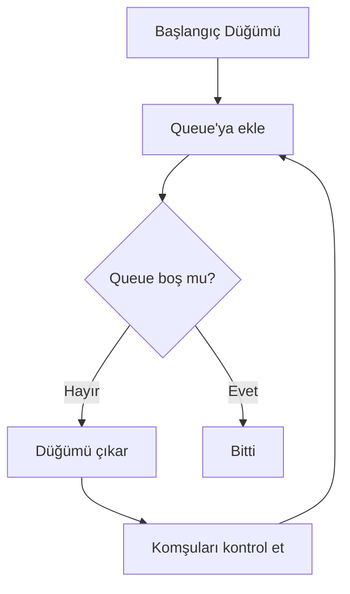
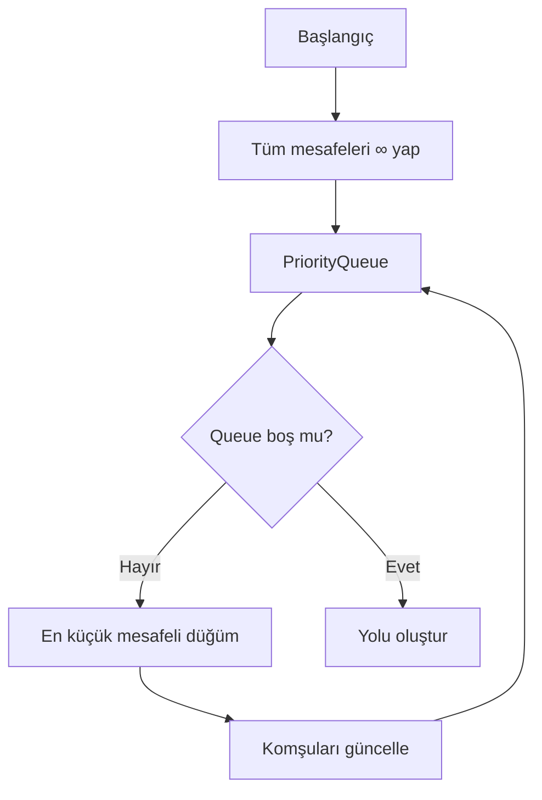
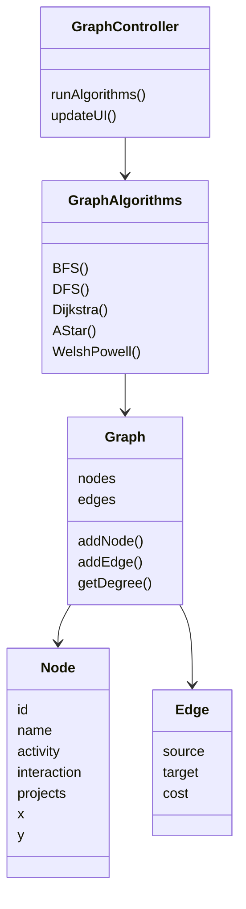
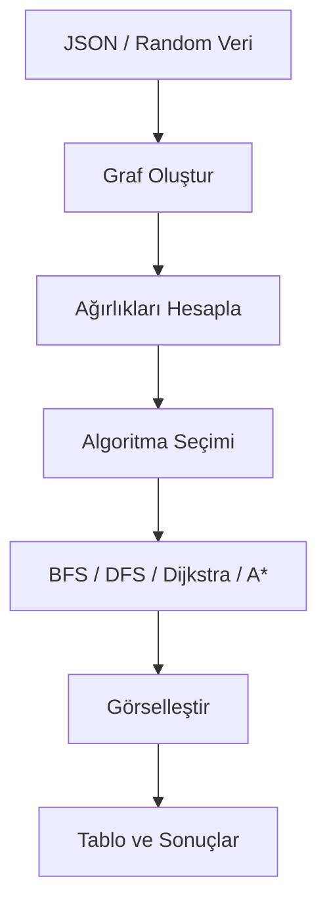

#  YazLab-2 – HR Social Network Analysis

## 1. Proje Bilgileri

* **Ders:** Yazılım Geliştirme Laboratuvarı-I
* **Proje Adı:** YazLab-2 – HR Social Network Analysis
* **Tarih:** 01.01.2026

###  Ekip Üyeleri

* **Anisa Nezhmi Emin** – 221307118
* **Ülkü Hatip** – 231307028

---

## 2. Giriş – Problem Tanımı ve Amaç

Bu proje, bir kurum içerisindeki çalışanlar arasındaki ilişkileri analiz etmek amacıyla geliştirilmiş bir **HR Sosyal Ağ Analizi Uygulamasıdır**. Çalışanlar bir graf yapısında **düğüm (Node)** olarak temsil edilirken; aralarındaki etkileşimler, birlikte çalışılan projeler ve organizasyonel bağlar **ağırlıklı kenarlar (Edge)** ile modellenmiştir.

Amaç; çalışanların **aktiflik**, **etkileşim** ve **proje sayısı** gibi sayısal özelliklerini kullanarak bağlantı ağırlıklarını **dinamik biçimde hesaplamak** ve bu yapı üzerinde çeşitli **graf algoritmaları** çalıştırarak organizasyonel analizler gerçekleştirmektir.

---

## 3. Kullanılan Algoritmalar

### 3.1 Breadth-First Search (BFS)

#### Akış Diyagramı

#### Karmaşıklık Analizi

* **Zaman:** O(V + E)
* **Bellek:** O(V)

#### Literatür

BFS algoritması sosyal ağ analizlerinde erişilebilirlik ve bağlı bileşen tespiti için yaygın olarak kullanılmaktadır
(Cormen et al., *Introduction to Algorithms*).

---

### 3.2 Depth-First Search (DFS)

#### Karmaşıklık Analizi

* **Zaman:** O(V + E)
* **Bellek:** O(V)

DFS, graf üzerinde derinlemesine arama yaparak düğümler arası yapısal ilişkilerin incelenmesini sağlar.

---

### 3.3 Dijkstra En Kısa Yol Algoritması

#### Akış Diyagramı

#### Karmaşıklık Analizi

* **Zaman:** O(E log V)
* **Bellek:** O(V)

Dijkstra algoritması ağırlıklı graflarda en kısa yol problemlerinin çözümünde klasik bir yöntemdir.

---

### 3.4 A* (A-Star) Algoritması

#### Karmaşıklık Analizi

* **Zaman:** O(E log V)
* **Bellek:** O(V)

A* algoritması, Dijkstra’ya sezgisel (heuristic) fonksiyon ekleyerek hedef düğüme daha hızlı ulaşmayı amaçlar.

---

### 3.5 Bağlı Bileşenler

Graf içerisindeki ayrık topluluklar BFS kullanılarak tespit edilmiştir. Her BFS çağrısı yeni bir bağlı bileşeni temsil eder.

---

### 3.6 Merkezilik (Degree Centrality)

#### En Yüksek Dereceli 5 Çalışan

| Sıra | Çalışan | Bağlantı Sayısı |
| ---- | ------- | --------------- |
| 1    | Emp 7   | 6               |
| 2    | Emp 3   | 5               |
| 3    | Emp 12  | 5               |
| 4    | Emp 1   | 4               |
| 5    | Emp 9   | 4               |

---

### 3.7 Welsh–Powell Graf Renklendirme

#### Renklendirme Tablosu

| Düğüm  | Derece | Renk    |
| ------ | ------ | ------- |
| Emp 7  | 6      | Mavi    |
| Emp 3  | 5      | Pembe   |
| Emp 12 | 5      | Sarı    |
| Emp 1  | 4      | Turuncu |
| Emp 9  | 4      | Mor     |

---

## 4. Sistem Mimarisi ve Sınıf Yapısı

---

## 5. Dinamik Kenar Ağırlığı Hesaplama

Ağırlık hesaplaması düğümlerin sayısal özellik farklarına dayalı olarak yapılmaktadır.

[
Ağırlık(i,j) = \frac{1}{1 + \sqrt{(A_i - A_j)^2 + (E_i - E_j)^2 + (P_i - P_j)^2}}
]

* Benzer özelliklere sahip düğümler → **yüksek ağırlık**
* Farklı özelliklere sahip düğümler → **düşük ağırlık**

Bu değerler Dijkstra ve A* algoritmalarında kenar maliyeti olarak kullanılmıştır.

---

## 6. Veri Saklama ve Yükleme

Veriler **JSON formatında** saklanmaktadır.

### Komşuluk Listesi Örneği

| Düğüm | Komşular            |
| ----- | ------------------- |
| Emp 1 | Emp 2, Emp 5, Emp 7 |
| Emp 2 | Emp 1, Emp 3        |
| Emp 3 | Emp 2, Emp 7        |

Hatalı veri (tekrar eden ID, self-loop) durumlarında kullanıcı bilgilendirilir ve veri sisteme eklenmez.

---

## 7. Uygulama Genel İş Akışı

---

## 8. Testler ve Performans

| Algoritma    | Düğüm Sayısı | Kenar Sayısı | Süre (ms) |
| ------------ | ------------ | ------------ | --------- |
| BFS          | 20           | 35           | 1.2       |
| DFS          | 20           | 35           | 1.0       |
| Dijkstra     | 20           | 35           | 2.1       |
| A*           | 20           | 35           | 1.6       |
| Dijkstra     | 100          | 240          | 14.8      |
| Welsh–Powell | 100          | 240          | 9.5       |

### Uygulama Ekran Görüntüleri

**Algoritma Performans Karşılaştırması (Compare All)**  

**Welsh–Powell Graf Renklendirme Sonucu**  

**Dijkstra En Kısa Yol Animasyonu (Dinamik Ağırlıklar)**  

---

## 9. Sonuç ve Tartışma

### Başarılar

* Dinamik ağırlık hesaplama
* Tüm istenen algoritmaların uygulanması
* Görselleştirme ve animasyon desteği

### Sınırlılıklar

* Çok büyük graflarda performans düşüşü
* Regex tabanlı JSON ayrıştırma karmaşıklığı

### Olası Geliştirmeler

* Gerçek HR verileriyle entegrasyon
* Farklı merkezilik ölçütleri
* Zaman bazlı ilişki analizi

---

